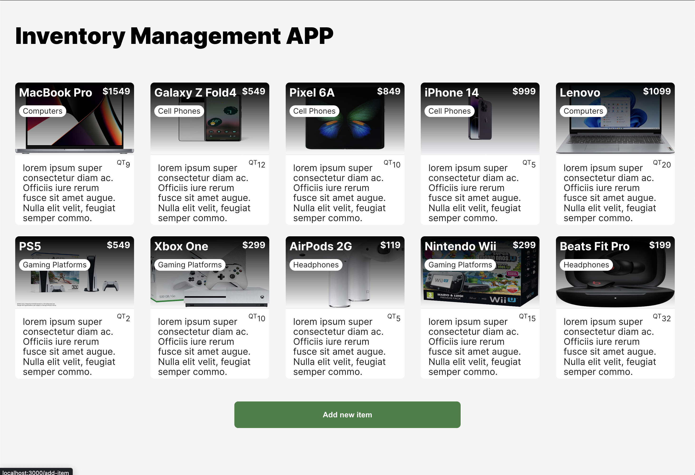
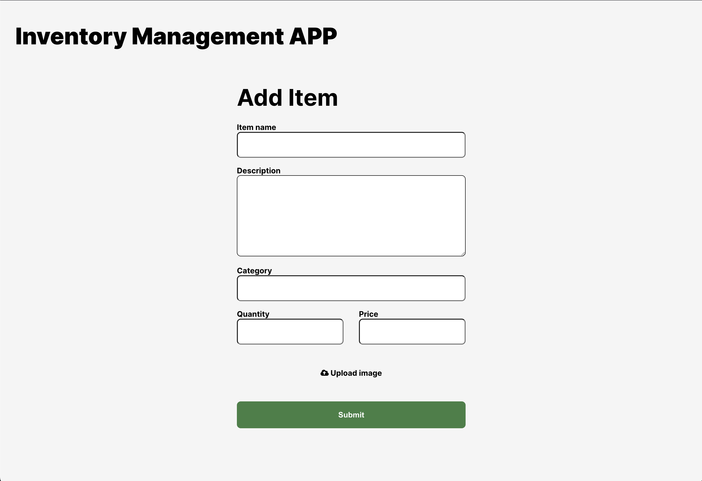

## Project #1
- This app is an inventory management system designed to help make tracking and managing inventory easier. The app was created to help businesses streamline their inventory management, reduce costs, and improve efficiency.
  
- The app tracks inventory items, quantity of items, pricing and current stock levels. It updates the inventory when inventory items are added or sold. Prior to building the program, it was important to outline the scope and goals of the app, create mockups of the user interface, and develop detailed project requirements and features.
  
- This application is an inventory management app built with React and Express. It allows users to add, view, edit, and delete items from their inventory.

The app consists of several components:

App.js: The main component that sets up the routes and fetches the items from the server.
Items.js: Renders a list of items, using the Item component to display each item's details.
Item.js: Represents an individual item card, displaying the item's information and linking to its detailed view.
AddItem.js: Provides a form to add a new item to the inventory.
ViewItem.js: Displays the details of a selected item, including the ability to edit or delete it.
The app uses React Router for routing and navigation between different pages. It also utilizes CSS modules for styling, where each component has its own unique CSS module.

On the server side, an Express router handles the API endpoints for fetching, adding, and deleting items from the database. The Item model, defined using Sequelize, represents the structure and behavior of the items in the database.

The desired result is achieved by fetching the items from the server using the fetchItems function in App.js and passing the data down to the Items component. The Item component is used to render each item's card, and the AddItem and ViewItem components handle adding a new item and displaying an item's details, respectively.

Overall, the application allows users to manage their inventory by adding, viewing, editing, and deleting items, providing a seamless user experience with the help of React, React Router, and Express.

- Here is the link to the repo https://github.com/VZ-Devs/Inventory-APP

Inventory APP

## Technologies
- React, Express and SQLLite

## Competencies
### JF 2
- Take a business or user problem, gather data to analyze the problem, and use prototyping tools to create a high fidelity wireframe and UI framework, test the application, and use agile project management

### JF 2.5/2.6/2.7
- I used user data and use cases to brainstorm an inventory web app, then created a prototype using a prototyping tool. I tested the wireframes and UI to guarantee a satisfactory experience for the user. I implemented agile project management practices to remain on schedule with the project.

### JF 2.5
- To accomplish the implementation of a responsive user interface in your application, the following actions were taken:

Utilized CSS modules and classNames to apply styles to the components.
Defined CSS rules and classes in separate CSS files, such as App.module.css, home.module.css, and add-item.module.css, to keep styles scoped to specific components.
Added responsive styles using media queries and flexbox to ensure proper layout and alignment on different screen sizes.

### JF 2.6
- To accomplish the implementation of wireframes into user interfaces, the following actions were taken:
- Wireframes:
Designed and Studied the wireframes to understand the desired layout, structure, and components of the user interface.
- Identified UI Components:
Identified the key components, sections, and elements depicted in the wireframes, such as headers, navigation bars, content sections, forms, buttons, and images.

### JF 2.7
To effectively manage state for complex user interfaces, the following actions were taken:
Identify Stateful Components:

Analyzed the UI components and determined which components require state management.
Identified components that have internal state or need to share state with other components.
Design State Structure:

Designed a clear and structured state object or state management approach that suits the complexity of the UI.
Determined the different pieces of state needed to represent the various aspects of the UI and their relationships.
Utilize React State Hooks:

Leveraged React's built-in state management capabilities, such as the useState hook, to create and manage state within functional components.
Declared state variables using the useState hook and provided initial values.
Used destructuring assignment to access state variables and their corresponding setter functions.
Lift State Up:

Identified cases where state needs to be shared across multiple components or passed to child components.
Lifted state up to a common ancestor component to make it accessible to the necessary child components.
Passed state variables and setter functions as props to child components to enable two-way communication.
Use Context API:

Utilized React's Context API to manage state when there is a need to share state across multiple layers of the component tree.
Created a context using createContext and wrapped the relevant components with a Provider to provide access to the shared state.
Consumed the shared state in child components using the useContext hook.

### The effects of taking these competencies were beneficial for the team, resulting in improved working methods, better comprehension of topics, faster development, and superior user interfaces.

