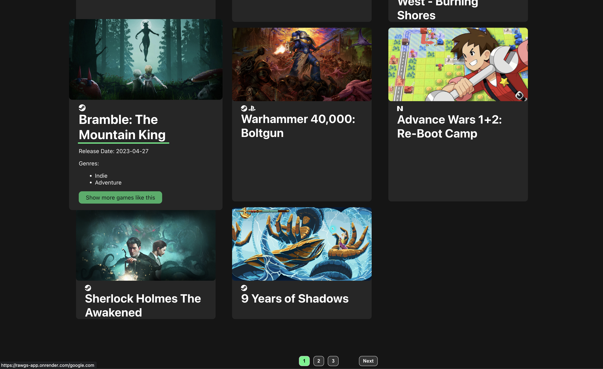
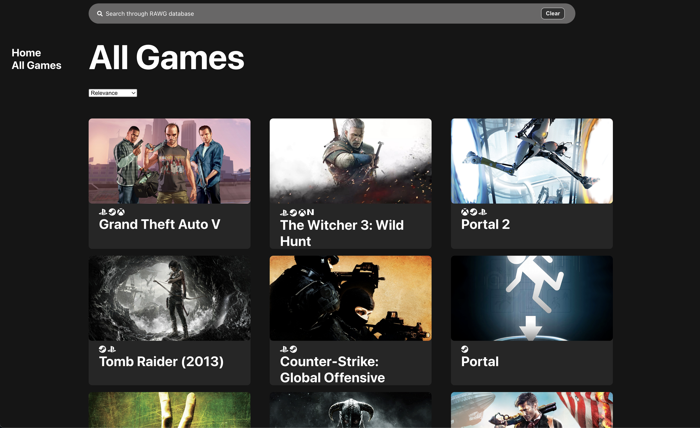

## Project #2
This application is a video game discovery platform designed to provide users with a comprehensive list of the latest and most popular games. Users will be able to view game reviews, trailers, screenshots, and other game-related content. Additionally, users will be able to save and organize favorites in their library, enabling them to easily access a list of games that they are interested in or that they want to follow. Ultimately, we created this program to give gamers the ability to discover and explore all types of games without having to search for them all over the web.

- The design process involved forming the program, deciding upon the page structure, figuring out the essential features and capabilities needed, producing wireframes to assist in the development procedure, selecting the visual design, and writing out user stories to help direct the development. Once all these pieces were in place, the development process began.
  
- This application is a game search and browsing interface that uses the RAWG API to fetch and display game data. It allows users to search for games, view detailed information about individual games, and browse through a list of trending and popular games.

To achieve the desired result, the following steps were taken:

Set up the project structure and dependencies: The project was set up using React and various dependencies such as react-router-dom, FontAwesome, and custom CSS stylesheets. The required API key was obtained for accessing the RAWG API.

Implemented search functionality: A SearchBar component was created to allow users to enter search queries. The entered search query triggers a search request to the RAWG API, fetching relevant game data based on the search query. The search results are stored in state variables for rendering.

Created a Home component: The Home component displays the search results or trending games, depending on the current state. It renders the Games component, passing the necessary props such as title, search results, pagination data, and functions to handle pagination.

Implemented pagination: The Games component handles pagination by fetching the next or previous page of game data from the RAWG API based on user interaction. The fetched data is then updated in the search results state, allowing users to navigate through the list of games.

Created individual game pages: The application allows users to click on a game card to view detailed information about the selected game. The ViewItem component displays the game's details, including its title, release date, genres, stores, and an option to delete the item.

Implemented navigation and routing: The react-router-dom library was used to handle navigation and routing within the application. Different routes were defined for the Home, Games, and NoMatch components, allowing users to navigate between pages seamlessly.

Styled the user interface: Custom CSS stylesheets were created to define the layout, typography, and visual elements of the application. The components were styled to provide an intuitive and visually appealing user interface.

Dockerized the application: The application was containerized using Docker, specifying the necessary build and runtime commands in the Dockerfile. This allows for easy deployment and distribution of the application as a Docker image.

Overall, this application provides a user-friendly interface for searching and browsing games, displaying relevant information, and supporting navigation between different views. It leverages the RAWG API and incorporates responsive design and routing techniques to create an interactive and engaging user experience.
  
- Here is the link to the app https://rawgs-app.onrender.com/
- Here is the link to the repo https://github.com/VZ-Devs/rawgs-app

## RAWG APP

  
  
  

## Technologies
- React, RAWG API, Docker, etc.
- Deployment using onrender
  
## Competencies
During the development of the app, pair programming was utilized to design the various features. I collaborated as the driver with the the creation of the front end components, I was responsible of deploying and dockerizing the app.

### JF 4
- Manage and deploy applications and programs, conduct testing, and adhere to industry security standards
- I was responsible for overseeing the launch of the rawg web app. After conducting some testing , I was able to deploy the app without any issues. The launch went off without a hitch; everything was completed smoothly and securely.

### JF 4.3
To build, manage, and deploy code into the relevant environment, the following actions were taken:

Set up the development environment: The necessary tools and dependencies were installed, including Node.js, package managers like pnpm, etc.

Project initialization: The project structure was set up, including the creation of the main application file, directory organization, and configuration files (such as package.json and vite.config.js).

Coding and testing: The code was written according to the desired functionality and requirements. Unit tests were created to ensure the code's correctness and to catch any potential issues or bugs.

Version control: A version control system (such as Git) was initialized to track changes in the codebase. Regular commits were made to capture incremental progress and allow for easy collaboration and code management.

Continuous integration and deployment (CI/CD): Continuous integration and deployment pipelines were set up to automate the build, testing, and deployment processes. This involved configuring build scripts, defining deployment environments, and integrating with CI/CD tools like Jenkins, Travis CI, or GitLab CI/CD.

By following these actions, the code was effectively built, managed, and deployed into the relevant environment, ensuring a streamlined development process, efficient code management, and reliable deployment of the application.

### JF 4.5
To ensure effective software testing, the following actions were taken:

Research and selection of testing frameworks: Different testing frameworks and methodologies were evaluated based on project requirements, technology stack, and community support. Popular testing frameworks include Jest, Mocha, Selenium, Cypress, and TestNG.

Test planning and strategy: A test plan was created to outline the scope, objectives, and approach for testing. This included determining the types of tests to be performed (e.g., unit tests, integration tests, end-to-end tests), identifying the test coverage, and defining the testing environment.

Unit testing: Unit tests were written to validate individual components or units of code in isolation. Frameworks like Jest or Mocha were used to define test cases, assertions, and test suites. Test-driven development (TDD) practices were followed, where tests were written before the corresponding code.

By following these actions, up-to-date testing frameworks and methodologies were applied to ensure thorough testing of the software, identify and resolve defects early in the development cycle, and deliver a high-quality product to end-users.

### JF 4.6
When writing unit tests, we can execute the test code and analyze the results to identify and correct errors found during the testing process.

Writing unit tests: Unit tests are typically written using a testing framework such as Jest or Mocha. These frameworks provide methods for defining test cases, assertions, and test suites. You write test code to simulate different scenarios and expected outcomes for the specific unit of code being tested.

Executing unit tests: Once the unit tests are written, you can execute them using the testing framework's test runner or test command. The test runner executes each test case and captures the results.

Analyzing test results: After the unit tests are executed, you can analyze the test results to identify any failures or errors. The testing framework provides detailed information about which test cases passed and which ones failed. It usually includes information such as the stack trace, expected and actual values, and any error messages.

Debugging and error correction: When a unit test fails, you can use the test results and the associated error information to identify the cause of the failure. This often involves debugging the code under test to understand why it didn't produce the expected outcome. By analyzing the failure and debugging the code, you can pinpoint the error and make the necessary corrections to fix the problem.

Re-running the unit tests: After correcting the errors, you can re-run the unit tests to ensure that the changes you made have resolved the issues. The testing framework will execute the tests again and provide updated test results.

Iterative testing and error correction: Unit testing is an iterative process. You may need to write additional test cases or modify existing ones based on the errors found and the changes made. You can repeat the cycle of writing tests, executing them, analyzing the results, and correcting errors until all the units are thoroughly tested and pass the tests.

By following this process, we can effectively test the code using unit tests and use the results to identify and correct errors. Unit testing helps improve code quality, maintain code integrity, and catch issues early in the development process, reducing the likelihood of bugs and errors in the final product.

## Lessons learned from the team during software development 
Effective communication: Clear and open communication among team members is crucial for successful collaboration. Regular team meetings, discussions, and status updates help ensure everyone is aligned, informed, and working towards common goals.

Collaboration and teamwork: Encouraging collaboration and fostering a supportive team environment leads to better outcomes. Teams learn the importance of sharing knowledge, leveraging each other's strengths, and working together to solve challenges.

Agile and iterative development: Adopting agile methodologies, such as Scrum or Kanban, helps teams embrace change, respond to feedback, and deliver incremental value. They learn the importance of iterative development, frequent feedback loops, and adapting plans based on evolving requirements.

Continuous improvement: Teams recognize the value of continuous learning and improvement. Regular retrospective meetings provide an opportunity to reflect on what worked well, identify areas for improvement, and implement changes to enhance team performance and productivity.

Quality assurance and testing: Teams understand the significance of incorporating quality assurance and testing processes throughout the development lifecycle. They learn to allocate sufficient time and resources for testing, implement automated testing frameworks, and establish solid QA practices to deliver high-quality software.

Version control and code management: Teams learn the importance of using version control systems (e.g., Git) to manage code changes, track history, and facilitate collaboration. They adopt best practices such as branching strategies, code reviews, and documentation to ensure code integrity and enable efficient collaboration.

Time management and planning: Teams learn to effectively manage their time and prioritize tasks to meet project deadlines. They understand the importance of accurate estimations, breaking down complex tasks into smaller ones, and managing dependencies to ensure timely delivery.

Adaptability and resilience: Teams encounter unexpected challenges and changes during the development process. They learn to be adaptable, embrace change, and find creative solutions to overcome obstacles. Resilience and perseverance are key qualities that help teams navigate through difficult situations.

### These lessons contribute to the growth and improvement of the team, enabling them to deliver high-quality software, collaborate effectively, and continuously enhance their processes and outcomes.

